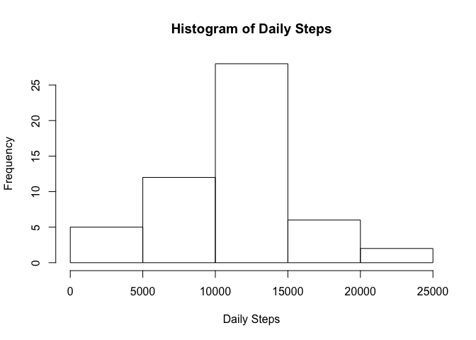
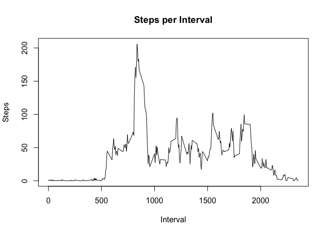
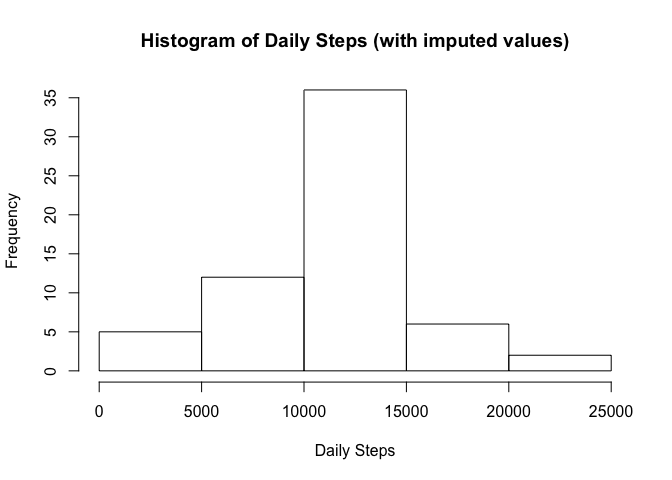
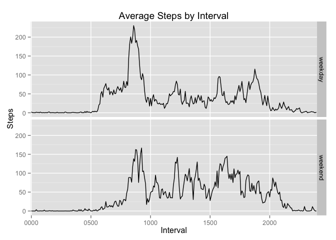

# Peer Assessment 1


```r
suppressMessages(library(dplyr))
suppressWarnings(library(stringr))
suppressWarnings(library(ggplot2))
```


### Loading and preprocessing the data

```r
data <- read.csv("activity.csv", header=TRUE, colClasses=c("numeric", "character", "character"))

#Left-pad the intervals with 0 so that they are consistently four characters.
data <- data%>%mutate(interval = str_pad(data$interval, 4, pad="0"))

#Convert the string dates to Date classes.
data <- data%>%mutate(date = as.Date(date))


#Remove NA measurements.
completeCases <- data[complete.cases(data),]

#Calculate total steps per day.
stepsPerDay <- completeCases%>%group_by(date)%>%summarize(stepsPerDay = sum(steps))
```

### What is the total number of steps taken per day?


```r
hist(stepsPerDay$stepsPerDay, main="Histogram of Daily Steps", xlab="Daily Steps", ylab="Frequency")
```

 

**Histogram of total steps per day:**  


```r
options (scipen=6, digits=2)
averageStepsPerDay <- mean(stepsPerDay$stepsPerDay)
medianStepsPerDay <- median(stepsPerDay$stepsPerDay)
```


**Average steps per day: 10766.19**  
**Median steps per day: 10765**  

### Average daily activity pattern?

```r
meanStepsPerInterval = completeCases%>%group_by(interval)%>%summarize(meanSteps = mean(steps))
plot(meanStepsPerInterval$interval, meanStepsPerInterval$meanSteps, type="l", main="Steps per Interval", xlab="Interval", ylab="Steps")
```

 


```r
maxSteps <- max(meanStepsPerInterval$meanSteps)

intervalWithMaxSteps = meanStepsPerInterval%>%filter(meanSteps == maxSteps)%>%select(interval)
```

**Interval with most steps: 0835**  

### Imputing missing values


```r
numberOfMissingValues <- nrow(data[is.na(data$steps),])
```

**Number of missing values: 2304**  


```r
##The imputing strategy is to convert NA values to the mean steps in that interval.

#Create new data frame as a copy of the "data" data frame. This is the "new dataset that is equal to the original dataset but with the missing data filled in."
dataWithImputedValues <- data.frame(steps=data$steps, interval=data$interval, date = data$date, stringsAsFactors=FALSE)

#The impute() function updates dataWithImputedValues$steps. If the value is NA, the value is updated to the mean of the interval. If the value is not NA, the value is not changed.
impute <- function(thisSteps, thisInterval){
    
    returnSteps <- thisSteps
    if (is.na(thisSteps)){
        returnSteps <- meanStepsPerInterval[meanStepsPerInterval$interval==thisInterval,]$meanSteps
        }
    
    returnSteps
    }

#Perform the update, calling the impute() function.
dataWithImputedValues$steps <- mapply(dataWithImputedValues$steps, FUN = impute, thisInterval=dataWithImputedValues$interval)

#Calculate steps per day including the imputed data.
stepsPerDayWithImputedValues <- dataWithImputedValues%>%group_by(date)%>%summarize(stepsPerDay = sum(steps))
```


**Histogram of total steps per day, including imputed data:**


```r
hist(stepsPerDayWithImputedValues$stepsPerDay, main="Histogram of Daily Steps (with imputed values)", xlab="Daily Steps", ylab="Frequency")
```

 

**Average steps per day: 10766.19**  
**Median steps per day: 10766.19**  

*With or without imputed values, the average and median are almost identical.*  


### Are there differences in activity patterns between weekdays and weekends?


```r
partOfWeek <- function(date){
    ifelse(weekdays(date) %in% c("Saturday", "Sunday"), "weekend", "weekday")
    }

dataWithImputedValues$partOfWeek <- sapply(dataWithImputedValues$date, FUN= partOfWeek)
dataWithImputedValues <- dataWithImputedValues%>%mutate(partOfWeek = as.factor(partOfWeek))

meanStepsPerIntervalAndPartOfWeek = dataWithImputedValues%>%group_by(partOfWeek,interval)%>%summarize(meanSteps = mean(steps))

p<- ggplot(meanStepsPerIntervalAndPartOfWeek, aes(x=interval, y=meanSteps, group=1))
p <- p + geom_line() + scale_x_discrete(breaks=c("0000", "0500", "1000", "1500", "2000"), labels=c("0000", "0500", "1000", "1500", "2000"))
p <- p + labs(x="Interval", y="Steps", title="Average Steps by Interval")
p <- p + facet_grid(partOfWeek ~ .)

p
```

 
